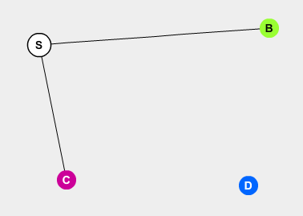

Given an undirected graph consisting of *N* nodes (labelled 1 to N) where a specific given node *S* represents the start position and an edge between any two nodes is of length 6 units in the graph.

It is required to calculate the shortest distance from start position (Node S) to all of the other nodes in the graph.

####Note 1:
If a node is unreachable, the distance is assumed as -1.
####Note 2:
The length of each edge in the graph is 6 units.

####Input Format

The first line contains *T*, denoting the number of test cases.

First line of each test case has two integers *N*, denoting the number of nodes in the graph and M, denoting the number of edges in the graph.

The next *M* lines each consist of two space separated integers *x,y,* where *x* and *y* denote the two nodes between which the edge exists.

The last line of a testcase has an integer *S*, denoting the starting position.

####Constraints
1 *<= T <=* 10

2 *<= N <=* 1000

1 *<= M <= (N * (N - 1)) / 2*

1 *<= x,y,S <=* N

####Output Format

For each of *T* test cases, print a single line consisting of *N*-1 space-separated integers, denoting the shortest distances of the N-1 nodes from starting position *S*. This will be done for all nodes same as in the order of input 1 to N.

For unreachable nodes, print -1.

####Sample Input

    2
    4 2
    1 2
    1 3
    1
    3 1
    2 3
    2

#####Sample Output

    6 6 -1
    -1 6

####Explanation

####For test cases 1:

The graph given in the test case is shown as :

S denotes the node 1 in the test case and B,C and D denote 2,3 and 4. Since S is the starting node and the shortest distances from it are (1 edge, 1 edge, Infinity) to the nodes B,C and D (2,3 and 4) respectively.

Node D is unreachable, hence -1 is printed (not Infinity).

####For test cases 2:
There are only one edge (2, 3) in a graph with 3 nodes, so node 1 is unreachable from node 2, and node 3 has one edge from node 2, each edge has the length of 6 units. So we output -1 6.